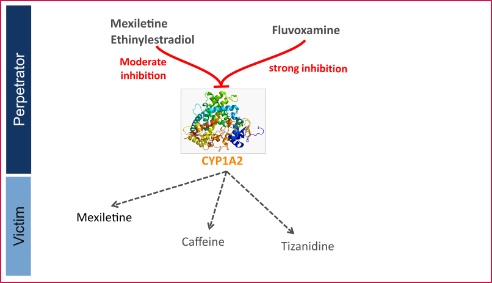

# Qualification-DDI-CYP1A2

Qualification of OSP platform for CYP1A2-mediated DDI

This repository contains a **qualification plan** (*qualification_plan.json*) including references to respective model snapshots and static content (e.g. text blocks, *.md files) to produce a **qualification report** evaluating the ability to perform simulations with the intended purpose to predict cytochrome P450 1A2 (**CYP1A2**)-mediated drug-drug interactions (**DDI**) of the PBPK platform **PK-Sim** (as part of the open systems pharmacology (OSP) suite) .

The latest release of the qualification plan and the static content can be found [here](../../releases/latest).

**The latest release of the qualification report can be found [here](https://github.com/Open-Systems-Pharmacology/OSP-Qualification-Reports/releases/latest).**

To demonstrate the level of confidence, the predictive performance of the platform for this intended purpose is assessed via a network of PBPK models of selected index CYP1A2 DDI perpetrators, and respective sensitive CYP1A2 victim drugs and a comprehensive dataset from published clinical DDI studies. All PBPK models represent whole-body PBPK models, which allow dynamic DDI simulations in organs expressing CYP1A2.

## Contacts
For your questions and comments about the models please create a new [issue](https://github.com/Open-Systems-Pharmacology/Qualification-DDI-CYP1A2/issues). A full publication about models presented is available at: https://www.mdpi.com/1999-4923/12/12/1191 .

## Code of conduct

Everyone interacting in the Open Systems Pharmacology community (codebases, issue trackers, chat rooms, mailing lists etc...) is expected to follow the Open Systems Pharmacology [code of conduct](https://github.com/Open-Systems-Pharmacology/Suite/blob/master/CODE_OF_CONDUCT.md#contributor-covenant-code-of-conduct).

## Contribution

We encourage contribution to the Open Systems Pharmacology community. Before getting started please read the [contribution guidelines](https://github.com/Open-Systems-Pharmacology/Suite/blob/master/CONTRIBUTING.md#ways-to-contribute). If you are contributing code, please be familiar with the [coding standard](https://github.com/Open-Systems-Pharmacology/Suite/blob/master/CODING_STANDARDS.md#visual-studio-settings).

## License

The model code is distributed under the [GPLv2 License](https://github.com/Open-Systems-Pharmacology/Suite/blob/develop/LICENSE).
